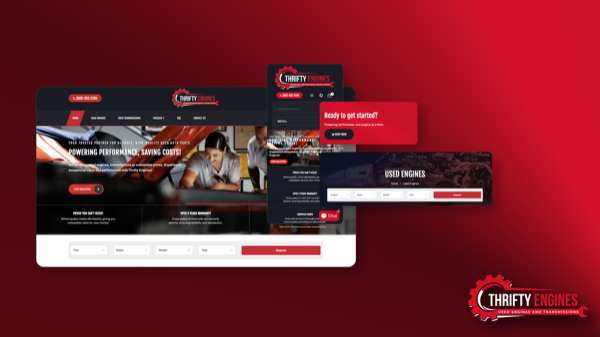
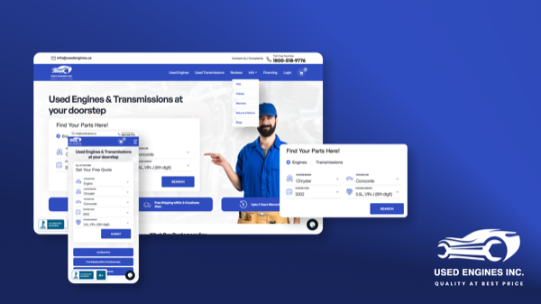

## About

Mohd Yahya is a Delhi-based design engineer with a passion for transforming complex challenges into simple, elegant design solutions. His work spans digital interfaces, interactive experiences, and the convergence of design and technology.

I'm Yahya, a software engineer at **Simublade**, where I craft intuitive user experiences. After hours, I build my own projects.

## Work Experience

### Simublade Technology Pvt. Ltd. — Software Engineer (Dec 2024 – Present)

|  [*Thrifty Engines*](https://yahyatarique.dev/work/thrifty-engines) |  [*Tropic Air*](https://yahyatarique.dev/work/tropic-air) |
| :-: | :-: |

Shopify-based e-commerce for used engines, transmissions & car parts. React Native mobile app for Belize's leading airline, integrating with TTI's flight systems API.

---

### Bitxia Tech Pvt. Ltd. — Software Engineer (Jul 2024 – Nov 2024)

|  [*eNAM 1.2 Platform*](https://yahyatarique.dev/work/enam-platform) |
| :-: |

National-level mandi trading system supporting ONDC integration. Contributed to eNAM 2.0 planning and design. Curated reusable NextJS-based Admin Panels.

---

### Simublade Technology Pvt. Ltd. — Jr. Software Engineer (Feb 2023 – Jul 2024)

|  [*Used Engines Inc.*](https://yahyatarique.dev/work/used-engines) |
| :-: |

NextJS-based Admin Panels, OfferApproved's website/admin panels, and the e-commerce platform for Used Engines Inc.

## Education

- **Galgotias University** — Software engineering, minor in UX design. Member, CamCircle.
- **Gandhi Co-Ed. Sr. Secondary School** — Physics, Chemistry, Maths with Computer Science. CBSE, New Delhi.

## Contact

- GitHub: [@yahyatarique](https://github.com/yahyatarique)
- LinkedIn: [@yahyatarique](https://www.linkedin.com/in/yahyatarique/)
- X: [@YahyaTarique](https://x.com/YahyaTarique)
- Email: [hello@yahyatarique.dev](mailto:hello@yahyatarique.dev)
- Portfolio: [yahyatarique.dev](https://www.yahyatarique.dev)
- Codepen: [yahyatarique](https://codepen.com/yahyatarique)

## Languages and Tools

  
  
  
  
  
  
  
  
  
  
  
  
  
  
  
  

  

