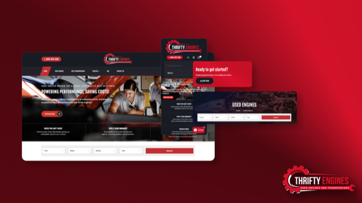
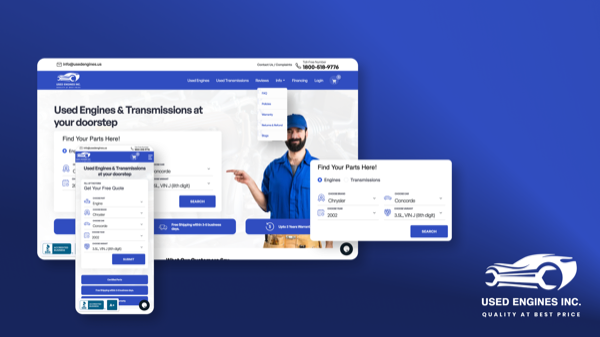
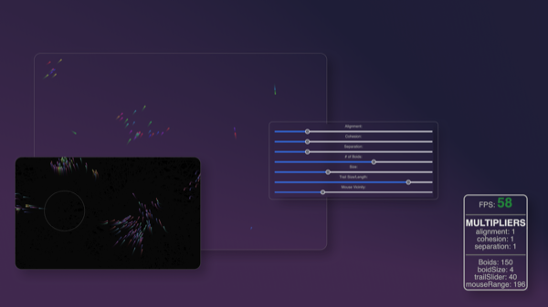

  <a href="https://www.yahyatarique.dev?utm_source=github&utm_medium=profile&utm_campaign=readme" target="_blank" rel="noopener"> Portfolio</a>
  &nbsp;·&nbsp;
  <a href="https://www.yahyatarique.dev/work/codepens?utm_source=github&utm_medium=profile&utm_campaign=readme" target="_blank" rel="noopener"> Showcase</a>
  &nbsp;·&nbsp;
  <a href="https://www.yahyatarique.dev/labs?utm_source=github&utm_medium=profile&utm_campaign=readme" target="_blank" rel="noopener"> Labs</a>
  &nbsp;·&nbsp;
  <a href="https://codepen.com/yahyatarique?utm_source=github&utm_medium=profile&utm_campaign=readme" target="_blank" rel="noopener"> Codepen</a>
  &nbsp;·&nbsp;
  <a href="mailto:hello@yahyatarique.dev" target="_blank"> Email</a>

<b>Product Engineer</b>

## About

Mohd Yahya is a Delhi-based design engineer with a passion for transforming complex challenges into simple, elegant design solutions. His work spans digital interfaces, interactive experiences, and the convergence of design and technology.

I'm Yahya, a software engineer at **Simublade**, where I craft intuitive user experiences. After hours, I build my own projects.

## Work Experience

### Simublade Technology Pvt. Ltd. — Software Engineer (Dec 2024 – Present)

|  [*Voxforce*](https://www.yahyatarique.dev/work/voxforce?utm_source=github&utm_medium=profile&utm_campaign=readme) |
| :-: |

AI video agents that talk, listen, and act in real time — client portal (Next.js), marketing site (Astro), and backend API (Node.js + PostgreSQL). Live at [voxforce.ai](https://voxforce.ai).

|  [*Thrifty Engines*](https://www.yahyatarique.dev/work/thrifty-engines?utm_source=github&utm_medium=profile&utm_campaign=readme) |  [*Tropic Air*](https://www.yahyatarique.dev/work/tropic-air?utm_source=github&utm_medium=profile&utm_campaign=readme) |
| :-: | :-: |

Shopify-based e-commerce for used engines, transmissions & car parts. React Native mobile app for Belize's leading airline, integrating with TTI's flight systems API.

### Bitxia Tech Pvt. Ltd. — Software Engineer (Jul 2024 – Nov 2024)

|  [*eNAM 1.2 Platform*](https://www.yahyatarique.dev/work/enam-platform?utm_source=github&utm_medium=profile&utm_campaign=readme) |
| :-: |

National-level mandi trading system supporting ONDC integration. Contributed to eNAM 2.0 planning and design. Curated reusable NextJS-based Admin Panels.

### Simublade Technology Pvt. Ltd. — Jr. Software Engineer (Feb 2023 – Jul 2024)

|  [*Used Engines Inc.*](https://www.yahyatarique.dev/work/used-engines?utm_source=github&utm_medium=profile&utm_campaign=readme) |
| :-: |

NextJS-based Admin Panels, OfferApproved's website/admin panels, and the e-commerce platform for Used Engines Inc.

## Selected Personal Work

|  [*Shareables*](https://www.yahyatarique.dev/work/shareables?utm_source=github&utm_medium=profile&utm_campaign=readme) |  [*LetsGetVisa*](https://www.yahyatarique.dev/work/letsgetvisa?utm_source=github&utm_medium=profile&utm_campaign=readme) |
| :-: | :-: |
| An AI agent studio that turns rough notes into branded, self-contained HTML pages and publishes immutable snapshots to [shareables.site](https://shareables.site). | Visa application and case management platform — customer portal, admin dashboard, and document workflows (React, Node.js, PostgreSQL). |

|  [*Vintage Snake Game*](https://www.yahyatarique.dev/work/snake-game?utm_source=github&utm_medium=profile&utm_campaign=readme) |  [*Flocking Simulator*](https://www.yahyatarique.dev/work/flocking-simulator?utm_source=github&utm_medium=profile&utm_campaign=readme) |
| :-: | :-: |
| The first project where programming logic truly clicked — vanilla JS, CSS Grid, roaming enemies. [Playable in the case study](https://www.yahyatarique.dev/work/snake-game?utm_source=github&utm_medium=profile&utm_campaign=readme). | Craig Reynolds' boids algorithm in JavaScript — emergent group behaviour, animated in real time. [Live demo](https://flockingsimulator.netlify.app). |

## Labs

Free tools I use in my own workflow, running in the browser at [yahyatarique.dev/labs](https://www.yahyatarique.dev/labs?utm_source=github&utm_medium=profile&utm_campaign=readme):

- [**ChatGPT 5 OSS Playground**](https://www.yahyatarique.dev/labs/chat5-playground?utm_source=github&utm_medium=profile&utm_campaign=readme) — chat with the open-source ChatGPT 5 (20B) model, tweaking system prompt & temperature.
- [**Pixel Avatar Generator**](https://www.yahyatarique.dev/labs/pixel-avatar-generator?utm_source=github&utm_medium=profile&utm_campaign=readme) — turn a photo into a downloadable pixel-art avatar, entirely client-side.
- [**Matplotlib Visualizer**](https://www.yahyatarique.dev/labs/matplotlib-visualizer?utm_source=github&utm_medium=profile&utm_campaign=readme) — write Python + Matplotlib in-browser (Pyodide) and render charts instantly.

## Creative Coding

A curated set of CodePen experiments — CSS effects, generative visuals, and playful browser interactions — with large previews and a page per Pen: [yahyatarique.dev/work/codepens](https://www.yahyatarique.dev/work/codepens?utm_source=github&utm_medium=profile&utm_campaign=readme).
